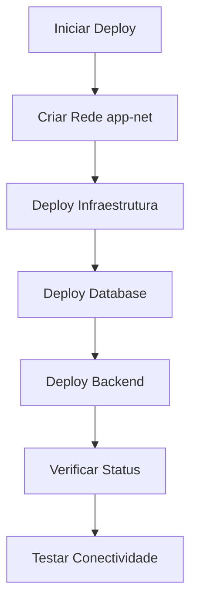

# 🌐 Rede App-Net - AUMIGOPET

## 📋 Visão Geral

A rede `app-net` é uma rede Docker bridge personalizada que conecta todos os serviços do AUMIGOPET, garantindo comunicação segura e isolada entre os containers.

## 🔧 Configuração

### Rede Bridge
- **Nome**: `app-net`
- **Driver**: `bridge`
- **Subnet**: `172.20.0.0/16`
- **Gateway**: `172.20.0.1`

## 📁 Arquivos Configurados

Todos os arquivos `docker-compose.yml` foram atualizados para usar a rede `app-net`:

- ✅ `docker-compose.yml` - Desenvolvimento
- ✅ `docker-compose.prod.yml` - Produção
- ✅ `docker-compose.unified.yml` - Deploy unificado
- ✅ `docker-compose.backend.yml` - Backend apenas
- ✅ `docker-compose.database.yml` - Database apenas
- ✅ `docker-compose.monitoring.yml` - Monitoramento
- ✅ `docker-compose.infrastructure.yml` - Infraestrutura

## 🚀 Scripts de Gerenciamento

### Script Principal
```bash
./scripts/deploy.sh [comando]
```

**Comandos disponíveis:**
- `network create` - Criar rede
- `network status` - Verificar status
- `network remove` - Remover rede
- `infra` - Deploy infraestrutura
- `backend` - Deploy backend
- `unified` - Deploy completo
- `database` - Iniciar database
- `monitoring` - Iniciar monitoramento
- `status` - Status geral
- `logs` - Ver logs
- `stop` - Parar tudo
- `cleanup` - Limpeza

### Script de Rede
```bash
./scripts/network-manager.sh [comando]
```

**Comandos disponíveis:**
- `create` - Criar rede app-net
- `status` - Verificar status da rede
- `remove` - Remover rede app-net
- `help` - Exibir ajuda

## 🔗 Serviços Conectados

### Infraestrutura
- **nginx** - Reverse proxy (portas 80, 443)

### Backend
- **backend** - API NestJS (porta 3000)
- **migration** - Serviço de migração

### Database
- **db** - PostgreSQL (porta 5432)
- **redis** - Cache Redis (porta 6379)

### Monitoramento
- **prometheus** - Métricas (porta 9090)
- **grafana** - Dashboard (porta 3001)

## 🛠️ Uso Prático

### 1. Criar Rede
```bash
./scripts/deploy.sh network create
# ou
./scripts/network-manager.sh create
```

### 2. Deploy Completo
```bash
./scripts/deploy.sh unified
```

### 3. Deploy por Partes
```bash
# 1. Infraestrutura
./scripts/deploy.sh infra

# 2. Database
./scripts/deploy.sh database

# 3. Backend
./scripts/deploy.sh backend
```

### 4. Verificar Status
```bash
./scripts/deploy.sh status
```

### 5. Ver Logs
```bash
./scripts/deploy.sh logs
```

## 🔍 Verificações

### Status da Rede
```bash
docker network ls | grep app-net
docker network inspect app-net
```

### Containers Conectados
```bash
docker network inspect app-net --format='{{range .Containers}}{{.Name}} {{end}}'
```

### Conectividade
```bash
# Testar conexão entre containers
docker exec aumigopet-backend ping aumigopet-db
docker exec aumigopet-backend ping aumigopet-redis
```

## 🚨 Troubleshooting

### Rede Não Existe
```bash
./scripts/network-manager.sh create
```

### Containers Não Conectam
```bash
# Verificar se estão na mesma rede
docker inspect aumigopet-backend | grep -A 10 "Networks"
docker inspect aumigopet-db | grep -A 10 "Networks"
```

### Limpeza Completa
```bash
./scripts/deploy.sh stop
./scripts/deploy.sh cleanup
./scripts/network-manager.sh remove
./scripts/network-manager.sh create
```

## 📊 Benefícios

1. **Isolamento**: Comunicação isolada entre serviços
2. **Segurança**: Rede dedicada para a aplicação
3. **Escalabilidade**: Fácil adição de novos serviços
4. **Manutenibilidade**: Gerenciamento centralizado
5. **Performance**: Comunicação otimizada entre containers

## 🔄 Fluxo de Deploy



## 📝 Notas Importantes

- A rede é criada automaticamente pelos scripts de deploy
- Todos os serviços devem estar na mesma rede para comunicação
- A rede é persistente até ser explicitamente removida
- Containers podem se comunicar pelo nome do serviço
- A rede suporta até 65.534 endereços IP (172.20.0.2 - 172.20.255.254)
